# My Expense Manager

A comprehensive mobile application for tracking personal finances, built with React Native.

## UI Mockups

### Home Screen Views
| Main View | Add Transaction | Menu Open |
|-----------|----------------|------------|
|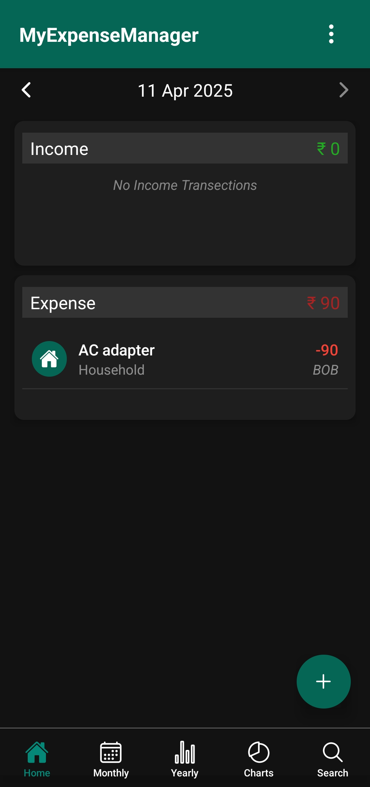|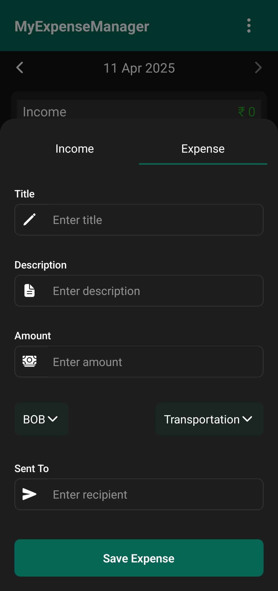|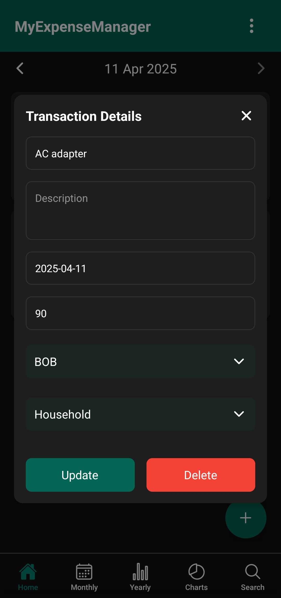|
| Daily transactions & balance | Quick transaction entry | Edit & Delete Transection |

### Monthly Analysis Views
| Overview | Transection View |
|----------|---------------|
|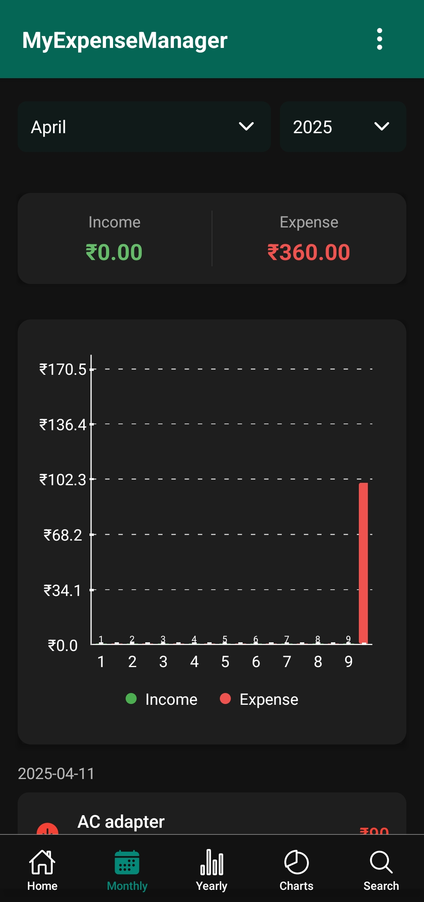|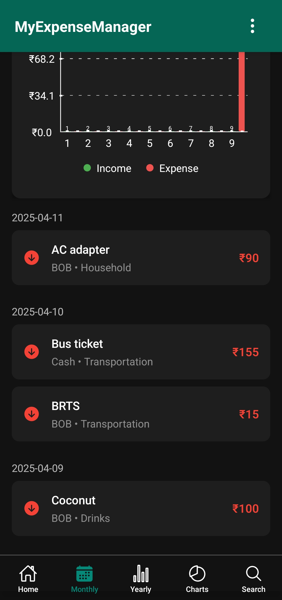|
| Trend analysis | Monthly summary |

### Yearly Overview Screens
| Chart View | Detailed View |
|-------------|---------------|
|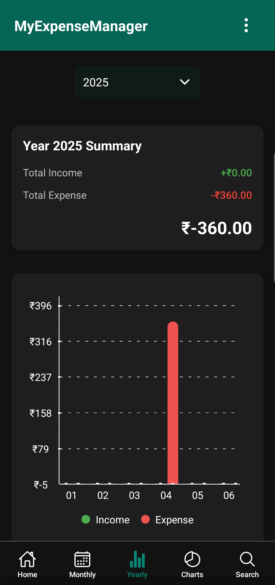|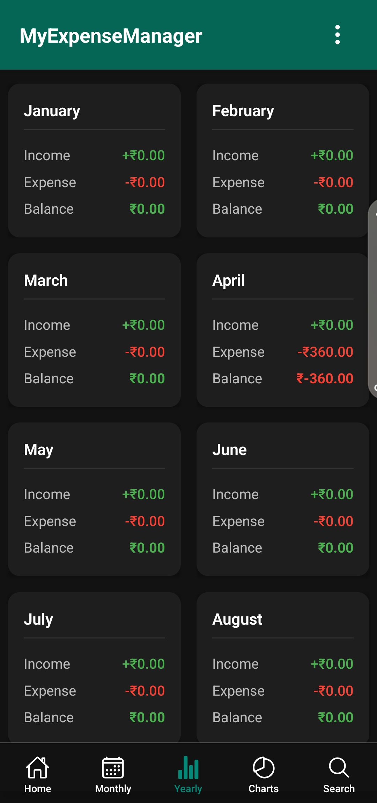|
| Visual comparisons | Annual overview |

### Charts Screen Views
| Chart View | Category Transaction |
|-----------|------------|
|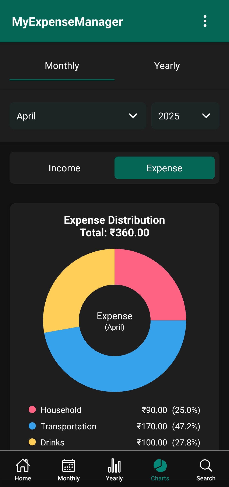|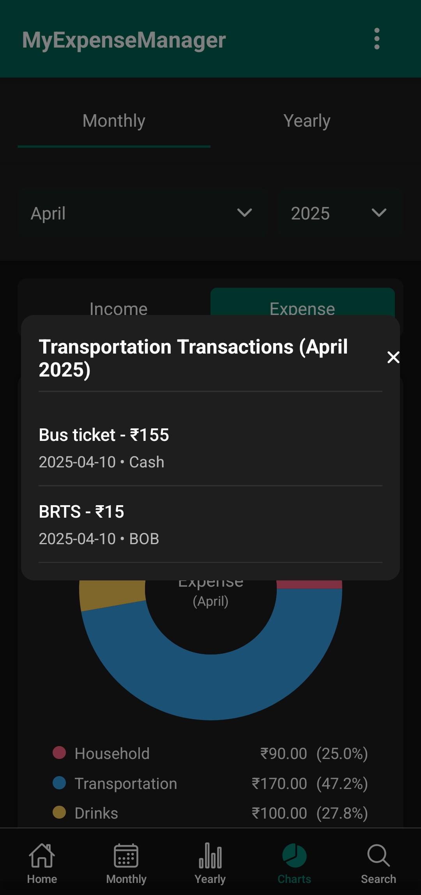|
| Detailed Charts | Category wise Transections |

### Export Screen Views
| Export View | PDF Export |
|-----------|------------|
|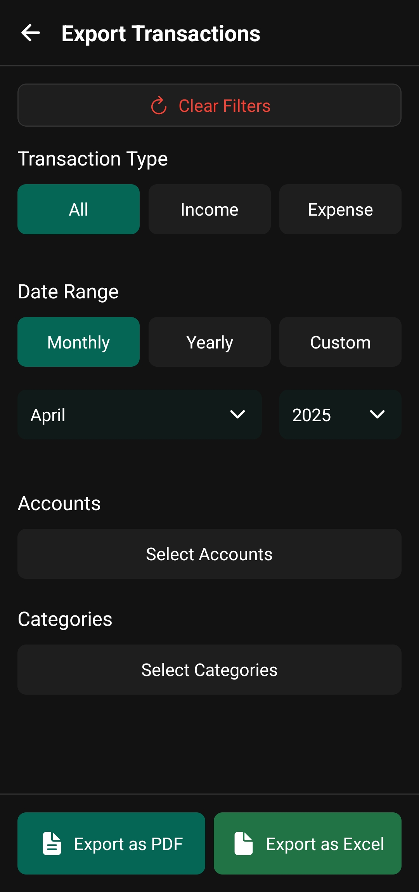|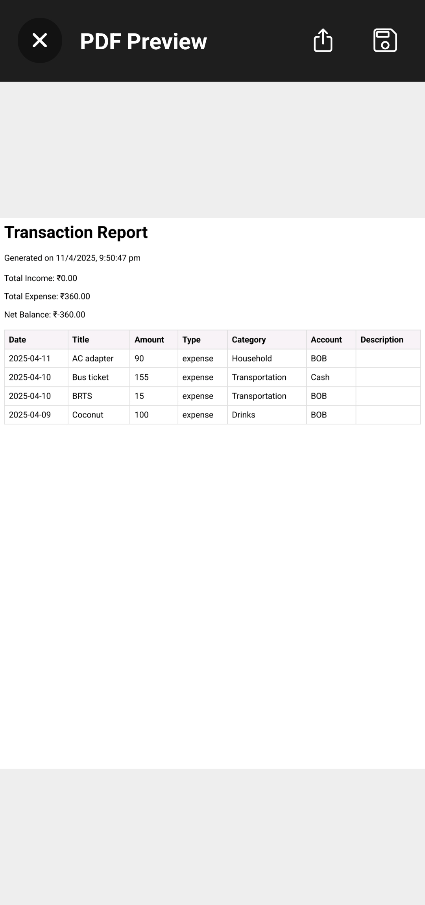|
| Filterd Exports | Preview/Save/Share Export |

### Settings & Search
| Settings View | About View | Search & Filter View |
|----------------|------------------|----------------|
|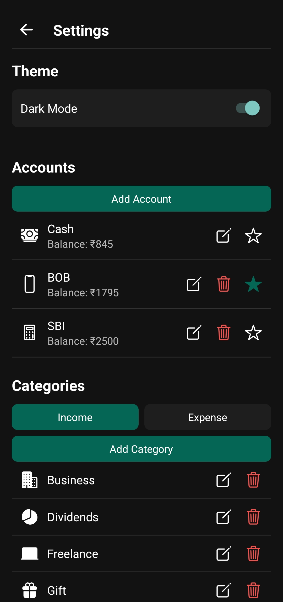|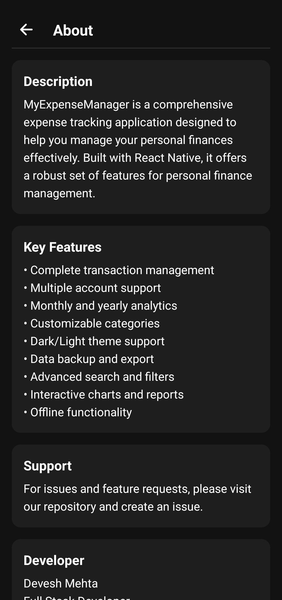|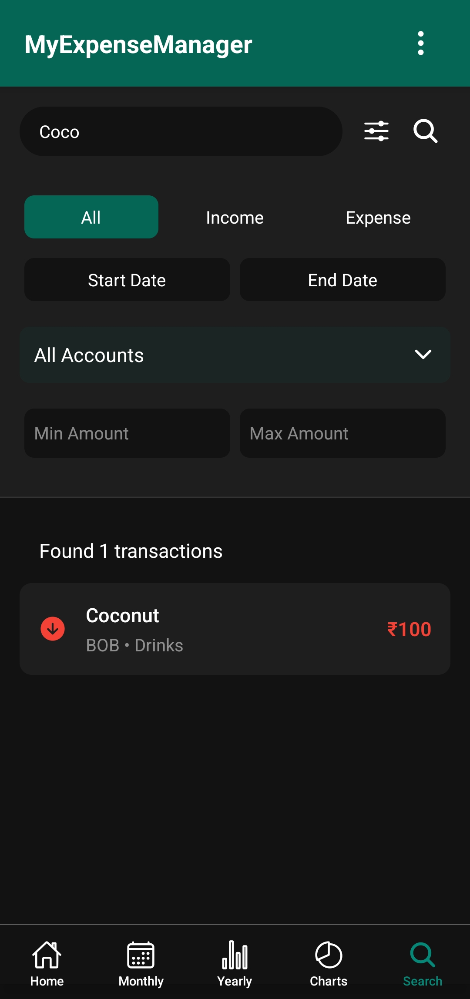|
| Theme/Account/Category customization | About App | Advanced search |

## Features

### Transaction Management
- Add income and expense transactions
- Multiple account support (Cash, Bank, UPI, etc.)
- Customizable categories for both income and expense
- Edit or delete existing transactions
- Quick access to recent transactions

### Date-based Navigation
- Swipe gestures for navigating between dates
- Date picker for quick navigation
- Future date transactions prevented
- View transactions by specific dates

### Monthly Overview
- Monthly income and expense summary
- Daily transaction breakdown
- Visual representation through graphs
- Navigate to specific dates from monthly view
- Monthly balance calculation

### Yearly Analysis
- Yearly income and expense overview
- Month-wise breakdown
- Visual charts for yearly comparison
- Quick navigation to monthly details
- Annual balance insights

### Search & Filters
- Search transactions by title
- Filter by transaction type (Income/Expense)
- Filter by account type
- Filter by date range
- Filter by categories

### Data Visualization
- Bar charts for yearly comparison
- Line graphs for monthly trends
- Income vs Expense visualization
- Interactive graphs with tooltips
- Clear visual indicators for financial trends

### Account Management
- Multiple account support
- Set default account
- Track balance per account
- Easy account switching
- Account-wise transaction history

### Data Management
- Export data to Excel
- Automatic daily backups
- Manual backup option
- Data restoration capability
- Secure local storage

### Customization
- Dark/Light theme support
- Customizable categories
- Account preferences
- Default view settings
- Currency format settings

### Initial Setup
- Guided first-time setup
- Account initialization
- Category setup
- Preferences configuration
- Quick start guide

### Additional Features
- Offline functionality
- Fast performance
- Intuitive UI/UX
- Data persistence
- Error handling

## Technical Details

### Built With
- React Native
- Redux for state management
- SQLite for local database
- React Navigation
- Gesture Handler
- Various charting libraries

### Data Storage
- Local SQLite database
- AsyncStorage for preferences
- Automatic backup system
- Excel export capability

### UI Components
- Custom navigation
- Interactive charts
- Modal forms
- Custom pickers
- Gesture controls

### Performance
- Optimized rendering
- Efficient data queries
- Smooth animations
- Responsive design
- Quick load times

## Getting Started

1. Clone the repository
2. Install dependencies: `npm install`
3. Run on Android: `npm run android`
4. Run on iOS: `npm run ios`

## Support

For issues and feature requests, please create an issue in the repository.

## Developer

### Muhammad Abdullah
- **Role**: Full Stack Developer
- **Specialization**: Mobile and Web Development
- **Tech Stack**: React Native, MERN Stack
- **GitHub**: [abdullahprince7717](https://github.com/abdullahprince7717)
- **LinkedIn**: [Muhammad Abdullah](https://www.linkedin.com/in/muhammad-abdullah-prince/)

### Contact
For professional inquiries or collaborations, feel free to connect on LinkedIn.

# Troubleshooting

If you're having issues getting the above steps to work, see the [Troubleshooting](https://reactnative.dev/docs/troubleshooting) page.

# Learn More

To learn more about React Native, take a look at the following resources:

- [React Native Website](https://reactnative.dev) - learn more about React Native.
- [Getting Started](https://reactnative.dev/docs/environment-setup) - an **overview** of React Native and how setup your environment.
- [Learn the Basics](https://reactnative.dev/docs/getting-started) - a **guided tour** of the React Native **basics**.
- [Blog](https://reactnative.dev/blog) - read the latest official React Native **Blog** posts.
- [`@facebook/react-native`](https://github.com/facebook/react-native) - the Open Source; GitHub **repository** for React Native.
